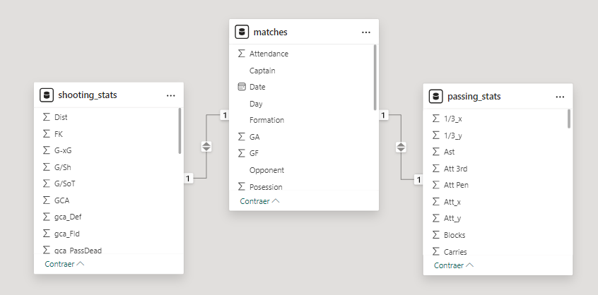
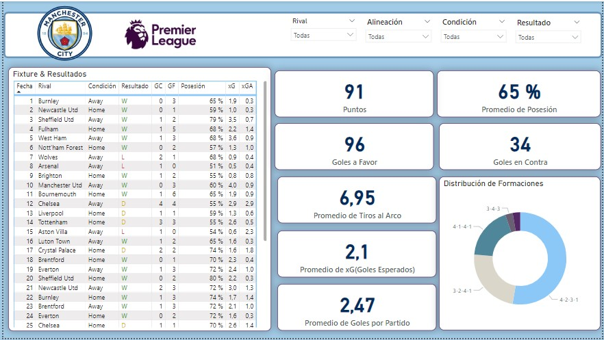
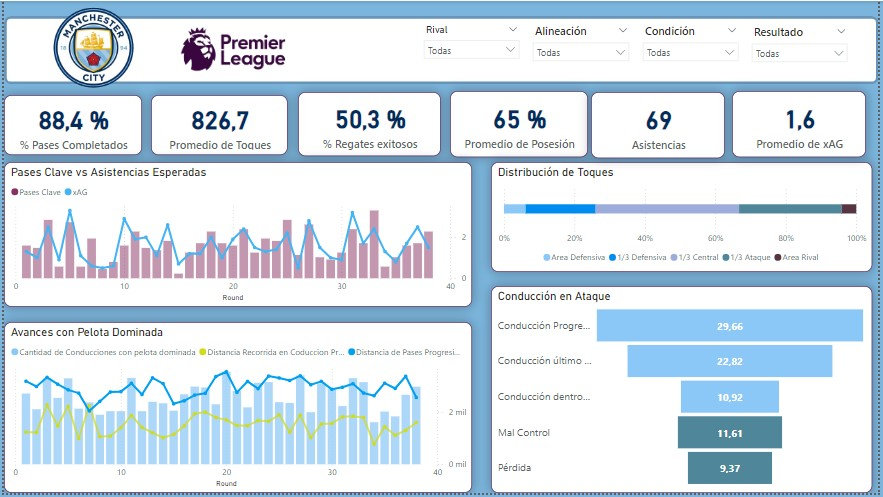
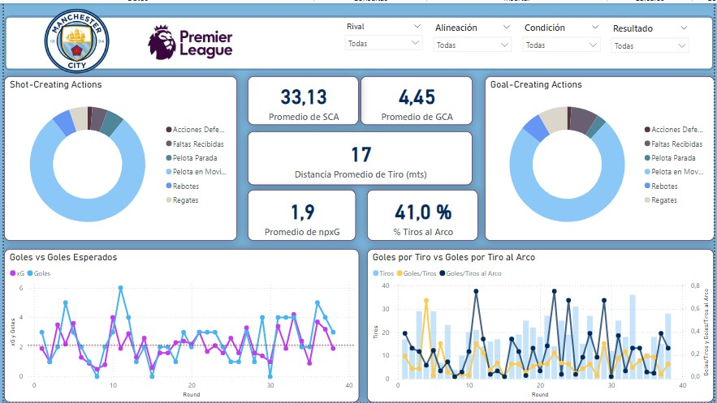

# Estadísticas Ofensivas del Manchester City (Premier League 2023/24)

  

#### **Proyecto de Análisis de Datos en Fútbol: Manchester City Temporada 2023/2024 en la Premier League - Énfasis en la Fase Ofensiva del Juego**

### Descripción del Proyecto:

El objetivo de este proyecto es analizar y visualizar la fase ofensiva del juego del equipo Manchester City durante la temporada 2023/2024 en la Premier League, con un enfoque especial en los pases y los tiros. Para llevar a cabo este análisis, se siguieron los siguientes pasos:

1. **Web Scraping en Python desde la página fbref**:
   - Se utilizó la librería `Requests` para realizar solicitudes HTTP a la página web fbref, obteniendo las páginas necesarias con los datos relevantes.
   - Con `BeautifulSoup`, se procedió a parsear el contenido HTML de las páginas obtenidas, extrayendo información específica sobre pases y tiros del equipo Manchester City.

2. **Manipulación y Transformación de Datos con Pandas**:
   - Los datos extraídos se almacenaron en DataFrames de Pandas para facilitar su manipulación y análisis.
   - Se realizaron diversas transformaciones y limpiezas de datos, incluyendo la conversión de tipos de datos, la eliminación de duplicados, y la agregación de estadísticas relevantes.

3. **Descarga de Datos a Formato .csv**:
   - Los DataFrames finales, que contenían las estadísticas ofensivas del Manchester City, fueron exportados a archivos .csv para su posterior análisis y visualización.
   - Estos archivos .csv fueron organizados para incluir columnas con métricas como número de pases, precisión de pases, número de tiros, y efectividad de los tiros.

4. **Visualización de las Estadísticas Ofensivas del Equipo en Power BI**:
   - Los archivos .csv generados se importaron en Power BI para crear visualizaciones interactivas y detalladas de las estadísticas ofensivas.
   - Se diseñaron gráficos y dashboards que muestran el rendimiento del equipo en términos de pases y tiros, proporcionando una visión clara de la fase ofensiva del juego del Manchester City durante la temporada.

### Resultados:

El análisis permitió resaltar la importancia del juego colectivo del Manchester City, caracterizado por una constante asociación de pases entre los jugadores. Se observó cómo el equipo inicia la creación de juego desde el primer tercio de la cancha, facilitando una construcción ofensiva sólida y eficiente. Las visualizaciones en Power BI mostraron que la fluidez y precisión en los pases son fundamentales para la generación de oportunidades de gol, evidenciando una cohesión y sincronización excepcionales entre los jugadores. Este enfoque en el juego colectivo y en la construcción de jugadas desde posiciones defensivas hasta el ataque permitió entender mejor la dinámica ofensiva del equipo y su capacidad para dominar los partidos a través de un control efectivo del balón.

### Descripción paso a paso:
#####   1) Web Scraping desde la página fbref con libreria Request y BeautifulSoup
#####   2) Manipulación y Transformación de Datos con Pandas
#####   3) Descarga de datos a formato .csv
#####   4) Visualización de las estadísticas ofensivas del equipo en Power Bi.

#### Archivos:
#####   - [📒Jupyter Notebook](WebScraping_fbref.ipynb)
#####   - 📚3 Archivos .csv: [Partidos](matches.csv), [Esatídisticas de Pases](passing_stats.csv) y [Estadísiticas de Tiros](shooting_stats.csv)
#####   - [📊Reporte interactivo en Power Bi](Manchester_City_Offensive_Stats.pbix)

  

Modelo de Datos

  

General stats

  

Passing stats

  

Shooting stats

