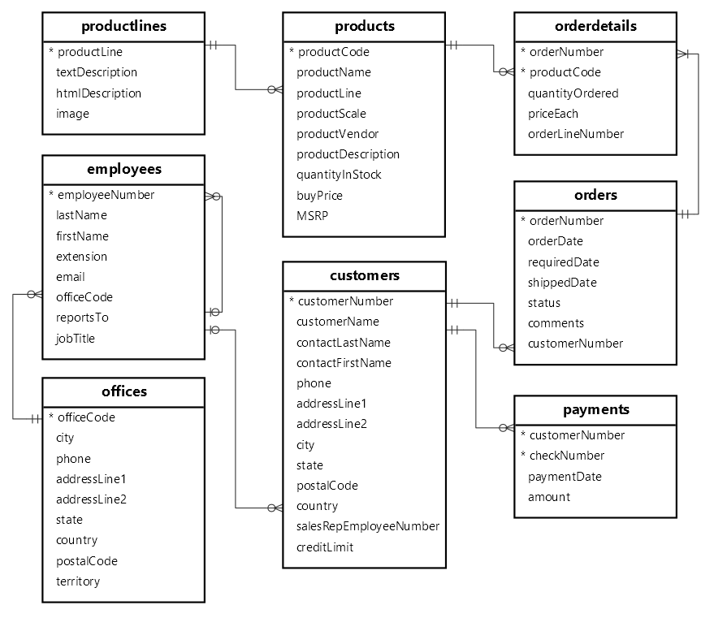

## Insights de Negocio con SQL

#### Introducción

La empresa "RetroRides Models"🚗, dedicada a la venta de modelos a escala de autos clásicos, se encuentra en la necesidad de obtener información clave para la toma de decisiones estratégicas. Para abordar esta necesidad, se utilizará la base de datos en formato MySQL denominada "classicmodels".

#### Objetivo

Este proyecto tiene como objetivo responder a una serie de interrogantes de negocio mediante el análisis de datos de la base de datos. A continuación, se presenta un conjunto de consultas diseñadas para proporcionar insights valiosos🎯 que ayudarán a RetroRides Models en su proceso de toma de decisiones. Le invitamos a descargar la base de datos ["classicmodels"](classicmodels.sql) y a interactuar con las siguientes consultas SQL. Cada consulta ha sido elaborada para extraer información específica y relevante para el negocio. A través de estas consultas, podrá obtener una comprensión profunda de los datos y descubrir patrones y tendencias que serán de gran utilidad para la empresa.

1.	Análisis de productos más vendidos: Utiliza la tabla products y la tabla orderdetails para determinar qué productos son los más populares. ¿Cuál es el top 5 de productos que se destacan en términos de ventas?[Query #1](Query%201.sql)
2.	Tendencias de ventas en el tiempo: Utiliza las tablas orders, orderdetails para obtener el total de ventas agrupadas por año y mes (puedes extraer el YEAR y MONTH de la fecha de venta) para conocer los tres meses de mayor venta histórica. ¿Cuáles son los tres meses que han logrado las mayores ventas de manera históricas?[Query #2](Query%202.sql)
3.	Eficiencia de los empleados: Analiza las tablas orders, customer y employees para evaluar el desempeño de los empleados. ¿Quiénes son los 5 vendedores más efectivos? (Recuerda concatenar firstName y LastName del empleado y usarlo para agrupar las ventas)[Query #3](Query%203.sql)
4.	Análisis de ventas por País: Usa las tablas orders y customers para mostrar el total de ventas por país y saber en cuáles de ellos hay mayor volumen de ventas. ¿Cuál es el ranking de ventas por países? (recuerda agrupar y ordenar los resultados).[Query #4](Query%204.sql)
5.	Análisis de ventas por país y ciudad: Usa las tablas orders y customers para mostrar el total de ventas por país y ciudad y saber en cuáles de las ciudades reportan mayor volumen de ventas. ¿Cuál es el ranking de ventas por ciudad? (recuerda agrupar y ordenar los resultados)[Query #5](Query%205.sql)
6.	Análisis de clientes: usa la tabla orders y customers para obtener las ventas agrupadas por clientes. ¿Cuál es el cliente al que más le hemos vendido?[Query #6](Query%206.sql)
7.	Análisis de precios: Usa la tabla products para analizar los precios unitarios de los productos. ¿Cuál es el promedio de precios de los productos? ¿Cuál es la diferencia de precios entre el producto más caro y el más barato?[Query #7](Query%207.sql)
8.	Análisis de la demanda: usa las tablas orders, ordersdetails y products para agrupar las cantidades vendidas de cada producto por mes y año. ¿Cuál es la demanda mensual histórica que tiene el producto “2001 Ferrari Enzo” código S12_1108?[Query #8](Query%208.sql)
9.	Eficacia de ventas: usa las tablas products y ordersdetails para obtener el conteo de productos registrados y vendidos respectivamente. ¿Toda la variedad de productos registrados han sido vendidos?[Query #9](Query%209.sql)
10.	Eficacia de ventas: usa los datos de la pregunta anterior y determina ¿Cuál es el producto o los productos que no se han vendido nunca?[Query #10](Query%2010.sql)

  

Modelo de Datos

