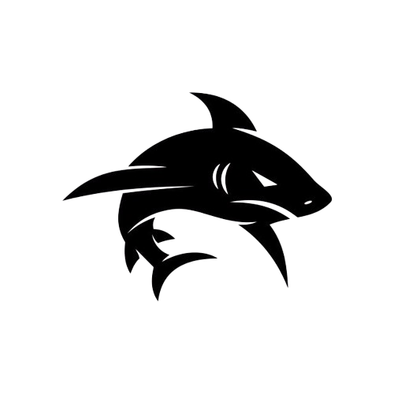

# Shark Attacks Incidents Report

  

## Descripción del Proyecto

El **Shark Attacks Incidents Report** es un proyecto de visualización de datos creado utilizando Power BI, basado en el **Conjunto de Datos Global de Ataques de Tiburones**. Este conjunto de datos proporciona registros actualizados diariamente sobre incidentes de ataques de tiburones en todo el mundo, haciendo especian enfasis en el pais Australiano ofreciendo información detallada sobre varios aspectos de cada incidente.

## Conjunto de Datos

El conjunto de datos incluye las siguientes características:

- **Fecha y ubicación del ataque**: Información precisa sobre cuándo y dónde ocurrió el ataque.
- **Detalles específicos de la actividad de la víctima**: Descripción de la actividad que estaba realizando la víctima en el momento del ataque.
- **Resultado del ataque**: Indicador de si el ataque resultó en una fatalidad o no.
- **Edad y descripción de la lesión**: Información adicional sobre la víctima y la gravedad de las lesiones.
- **Nombre de la víctima**: Si está disponible, el nombre de la persona involucrada en el incidente.
- **Tipo de incidente**: Clasificación del ataque como provocado o no provocado.
- **Categoría geográfica**: Clasificación de los incidentes por país y áreas específicas dentro de esos países.
- **Investigador o fuente**: Información sobre la fuente del reporte para verificación y análisis adicionales.

## Objetivo del Proyecto

El objetivo principal de este proyecto es proporcionar una herramienta visual interactiva que informe a las personas sobre los riesgos asociados con las actividades en aguas costeras. Además, busca:

- **Informar y educar**: Brindar información valiosa para investigadores y público en general sobre los incidentes de ataques de tiburones en todo el mundo.
- **Análisis de factores contribuyentes**: Identificar y analizar los factores que contribuyen a los ataques de tiburones.
- **Mejorar la comprensión entre tiburones y humanos**: Fomentar la educación sobre los riesgos y promover una convivencia segura en áreas costeras.

## Visualización en Power BI

La visualización de datos en Power BI incluye varios gráficos y tablas interactivas que permiten explorar y analizar los datos de manera efectiva. Algunas de las características del tablero incluyen:

- **Mapa interactivo**: Visualización geográfica de los incidentes de ataques de tiburones.
- **Gráficos de barras y líneas**: Análisis temporal y categórico de los incidentes.
- **Filtros y segmentaciones**: Herramientas para filtrar y segmentar los datos según diferentes criterios.

## Uso del Proyecto

Para utilizar este proyecto, simplemente descarga el archivo Power BI y ábrelo en tu aplicación Power BI Desktop. Los datos se actualizarán automáticamente si se configuran las conexiones adecuadas a la fuente de datos.

[Reporte](https://github.com/gonzadzz00/Proyectos/blob/main/%23Proyecto3%3A%20Data%20Viz/Sharks%20Incidents%20Reports.pbix)
[Informe](https://github.com/gonzadzz00/Proyectos/blob/main/%23Proyecto3%3A%20Data%20Viz/Global%20Shark%20Attack%20Incidents.pdf)

